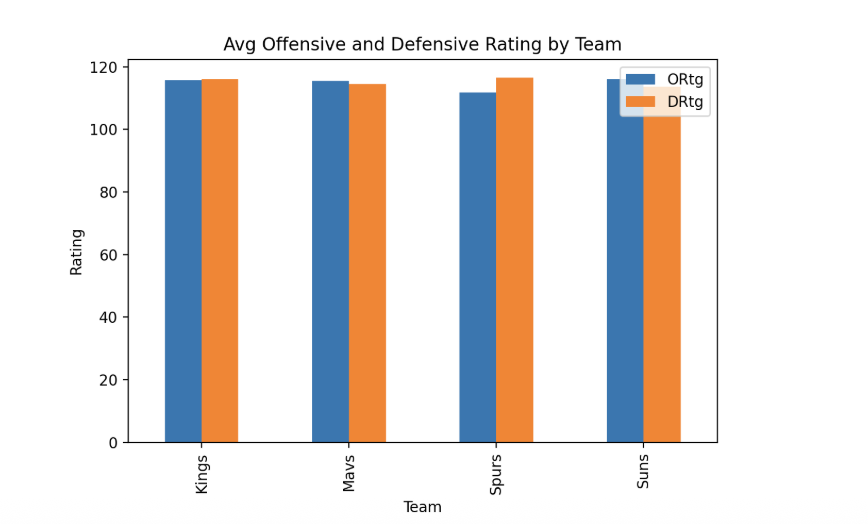
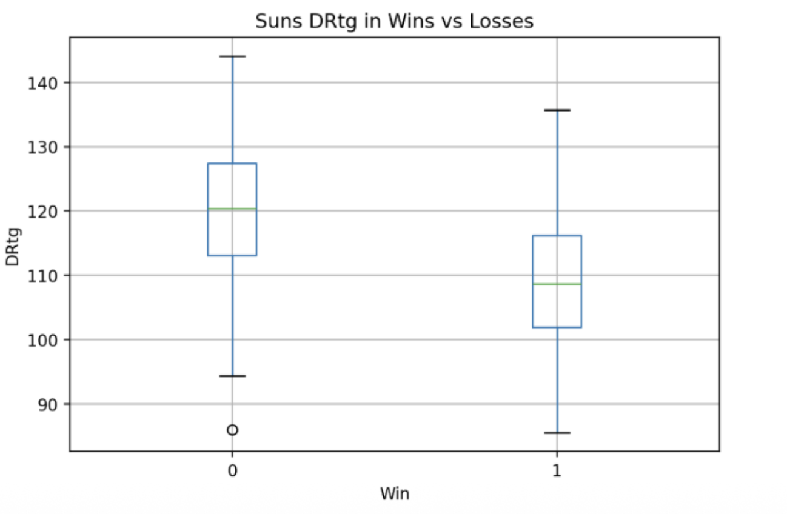
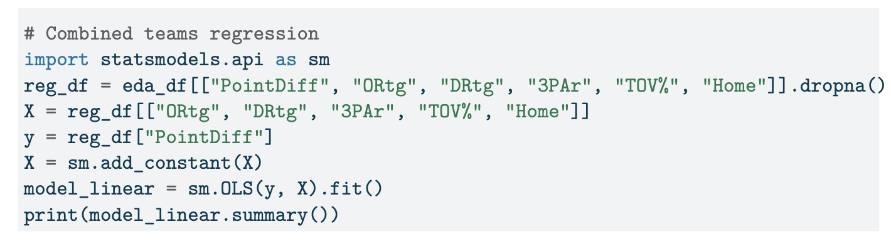
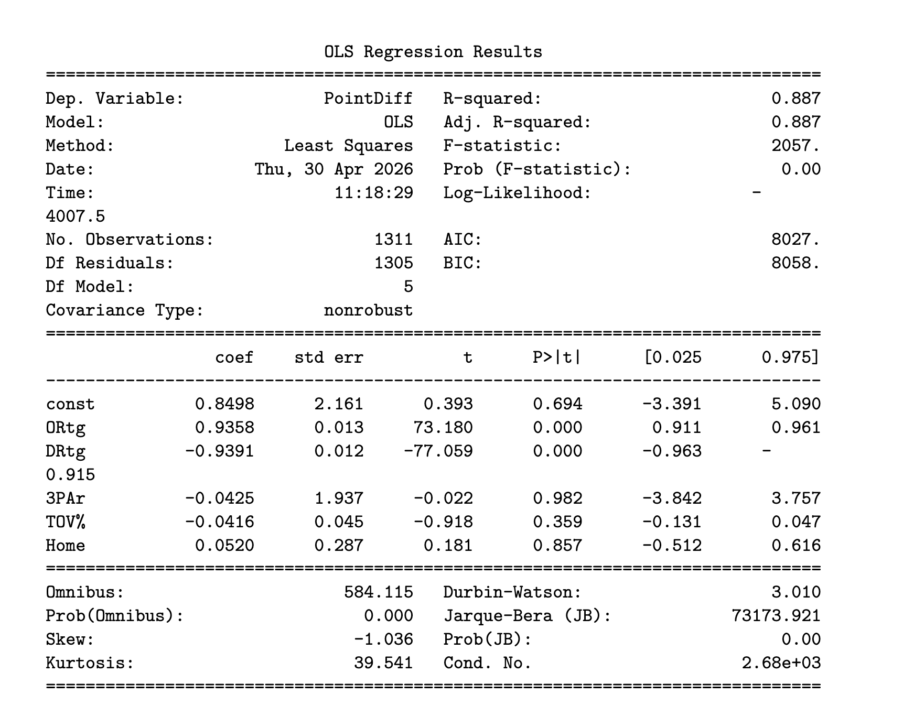
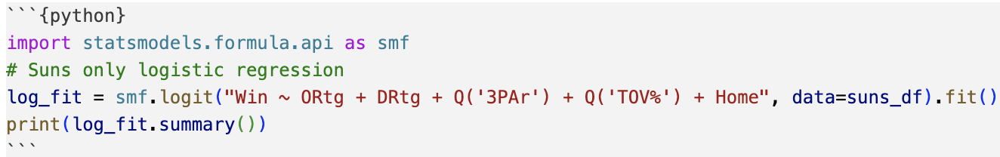
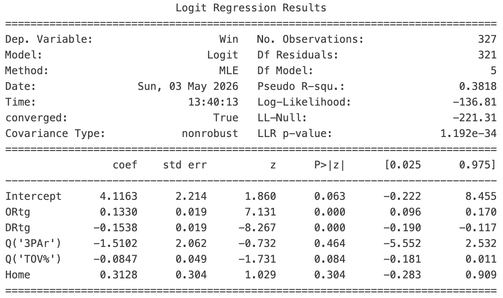
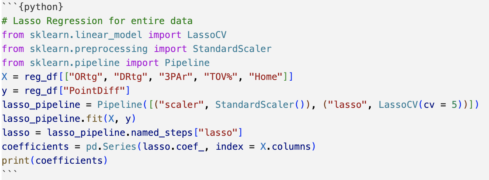
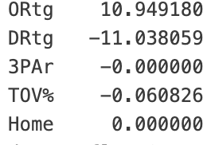
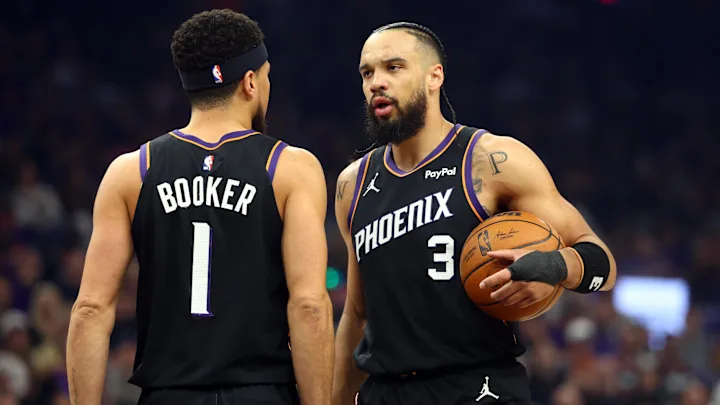

## Motivation & Problem Context

### Research Question{style="color: #E56020;"}

How do offensive efficiency, defensive efficiency, and shot selection influence the Phoenix Suns’ probability of winning games compared to top NBA teams?

### Why This Matters

-   Winning depends on **offensive and defensive efficiency**
-   Modern NBA strategy emphasizes **shot selection (2s vs 3s)**
-   Teams must decide where to focus improvement:
    -   Offense?
    -   Defense?
    -   Shot selection?

### Goal

Identify which factors **most strongly impact winning** and how the Suns compare to similar teams

## EDA Results & Analysis 

::::: columns
::: {.column width="50%"}
{width="110%"}

**Compared to other teams**

-   Suns had the best overall results

-   Suns and Mavs had similar offense, but Phoenix had stronger defense

-   The Suns’ edge came more from defense than offense
:::

::: {.column width="50%"}
{width="87%"}

**Suns-only**

-   In Suns wins, defensive rating dropped and shooting efficiency improved

-   Turnovers were lower in wins, while offensive rebounding changed little

-   Defense and efficiency mattered more than 3-point attempts

:::
:::::

## Linear Regression Results & Analysis

### Model: Predicting Point Differential - [All Teams]{style="color: #E56020;"}

### Key Results

-   **Offensive Rating (ORtg) = +0.94 points** [→]{style="color: #E56020;"} strong positive effect\
-   **Defensive Rating (DRtg) = –0.94 points** [→]{style="color: #E56020;"} strong negative effect\
-   **3P Attempt Rate (3PAr)** [→]{style="color: #E56020;"} not significant\
-   **Turnovers & Home** [→]{style="color: #E56020;"} not significant\

### Interpretation{style="color: #E56020;"}

- Offense and defense matter **equally and most**
- NBA success is built on maximum efficiency, not just smart shot selection.

------------------------------------------------------------------------

## Linear Regression Results & Analysis

### Model: Predicting Point Differential - [Suns Only]{style="color: #E56020;"}

### Key Results

-   **Offensive Rating (ORtg) = +0.67 points** [→]{style="color: #E56020;"} strong positive effect\
-   **Defensive Rating (DRtg) = –0.74 points** [→]{style="color: #E56020;"} strong negative effect\
-   **3P Attempt Rate (3PAr)** [→]{style="color: #E56020;"} not significant\
-   **Turnovers & Home** [→]{style="color: #E56020;"} not significant\

### Interpretation{style="color: #E56020;"}

- Defense has a slightly stronger impact than offense for the Suns.
- The Suns’ success is driven more by defensive performance than increasing 3-point volume.

------------------------------------------------------------------------

### Linear Regression - Code Demonstration

{width="65%"}
{width="50%"}

------------------------------------------------------------------------

## Logistic Regression Results & Analysis

### Model: Predicting Win Probability - [All Teams]{style="color: #E56020;"}

### Key Results

Using the variables:  Win ~ ORtg + DRtg + 3PAr + TOV% + Home

-   **R² = 0.684** [→]{style="color: #E56020;"} strong fit, explains much of the variation in wins/losses
-   **ORtg = 0.363** [→]{style="color: #E56020;"} statistically significant, higher offensive efficiency
-   **DRtg = -0.356** [→]{style="color: #E56020;"} statistically significant, better defense (low DRtg)

### Interpretation{style="color: #E56020;"}

-   Offensive & defensive efficiency are dominant predictors of winning for all teams
-   ORtg and DRtg coefficients are nearly identical in magnitude, so they roughly contribute equally to winning

------------------------------------------------------------------------

## Logistic Regression Results & Analysis

### Model: Predicting Win Probability - [Suns Only]{style="color: #E56020;"}

### Key Results

Using the variables:  Win ~ ORtg + DRtg + 3PAr + TOV% + Home

-   **R² = 0.382** [→]{style="color: #E56020;"} moderate fit, most likely other factors influencing Suns wins
-   **ORtg = 0.133** [→]{style="color: #E56020;"} statistically significant, higher offensive efficiency
-   **DRtg = -0.154** [→]{style="color: #E56020;"} statistically significant, better defense (low DRtg)
-   **DRtg** → slightly stronger effect than ORtg for Suns

### Interpretation{style="color: #E56020;"}

-  Suns' win probability is mainly driven by offensive and defensive efficiency
-  Suns' defense is slightly more important than offense

------------------------------------------------------------------------

## Logistic Regression - Code Demonstration

{width="85%"}
{width="70%"}

------------------------------------------------------------------------

## Lasso Regression for Validation

- ORtg and DRtg had largest coefficients
  - ORtg = 10.949180
  - DRtg = -11.038059

- TOV% had a small coefficient, larger for the Suns data model
  - TOV% = -0.060826
  - Suns_TOV% = -0.813990

- 3PAr and Home coefficients shrunk to zero

## Lasso Regression - Code Demonstration

{width="85%"}
{width="40%"}

## Confidence Intervals

- ORtg and DRtg intervals do not include 0

- 3PAr, Home, and TOV% all include 0

### Validation Conclusions{style="color: #E56020;"}

- ORtg and DRtg drive winning and point differential

- TOV% is more significant to the Suns 

- Home court and 3PAr have little to no effect on winning

## Current Utilization

-   Track ORtg, DRtg, TS%, and TOV% after each game
-   Compare each game’s numbers to the profile of a typical Suns win
-   If DRtg rises or TS% drops, coaches can flag defense and shot efficiency as problem areas
-   Use the model to identify whether losses were driven more by defense, efficiency, or turnovers
-   Apply these results in postgame review, opponent scouting, and game planning

{width="75%"}

------------------------------------------------------------------------

## Recommendations for Future Work

-   Include more seasons for a larger sample size [→]{style="color: #E56020;"} analyze if the same predictors contribute over time or if winning probability changes across seasons
-   Include player-level data [→]{style="color: #E56020;"} individual performance likely drives much of game-to-game variability
-   Include opponent strength as a predictor [→]{style="color: #E56020;"} winning against a team with poor defense inflates ORtg compared to winning against a team with strong defense

### [Broader Questions]{style="color: #E56020;"}

-   Do the same variables that predict regular seasons wins also predict playoff wins?
-   How do the predictors change when key players like Devin Booker or Jalen Green injured? Do the same efficiency metrics still drive wins without these players?

------------------------------------------------------------------------

## {data-background-image="images/suns_logo_orange.png" data-background-size="cover" data-background-opacity="0.6"}
[**Thank You & Go Suns!**]{style="color: white; font-size: 2em;"}