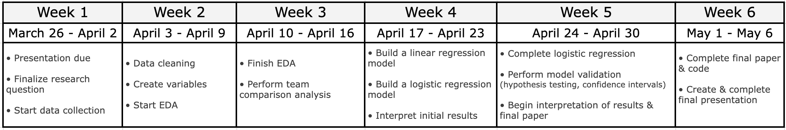

## Sport Introduction

**NBA Analytics and Dataset:**

-   Phoenix Suns game logs from the 2024-2025 season

-   The modern NBA relies heavily on data-driven analysis for strategy, medicine, player evaluation, and much more

-   Most basketball analysis focuses on possession-based and efficiency statistics, allowing us to compare teams independent of game pace

## Sport Introduction

**Key Analytics in Our Project:**

-   Offensive Rating(ORtg) = 100 x (Team Points) / (Team Possessions)

-   Defensive Rating(DRtg) = 100 x (Opponent Points) / (Opponent Possessions)

-   3-Point Attempt Rate (3PAr) = (3 Pointers Attempted) / (Field Goals Attempted)

-   Turnover Percentage(TO%) = (Turnovers) / (Field Goal Attempts + .44 x Free Throw Attempts + Turnovers)

-   Offensive Rebound Percentage(ORB%) = (Team Offensive Rebounds) / (Team Offensive Rebounds + Opponent Defensive Rebounds)

## Overview

**Question:** How do offensive efficiency, defensive efficiency, and shot selection (2PA vs. 3PA rates) influence the Phoenix Suns’ probability of winning games compared to top NBA teams?

**Why It Matters:**

-   Winning in basketball is driven by both scoring efficiency and defensive performance

-   Shot selection (2s vs. 3s) reflects modern game strategy

-   Understanding these factors helps identify what truly separates elite teams from average teams

## Motivation

**Coach’s Perspective:**

-   Where should we focus our improvement: offense or defense?

-   Is our current shot selection maximizing wins?

-   How does our playing style compare to top teams?

**Value of Data-Driven Insights:**

-   Guides smarter strategy decisions

-   Improves resource allocation (training, player roles)

-   Helps optimize game plans to increase win probability

## Semester Goal

By the end of the semester, we will build a logistic regression model and linear regression model using game-level data from the 2024-2025 season to quantify how offensive efficiency, defensive efficiency, and shot selection (two-point attempt rate vs. three-point attempt rate) influence the Phoenix Suns’ probability of winning, and compare those relationships to similar teams in the NBA by winning percentage.

## Benchmarks and Task Breakdown

1.  **Data Acquisition & Cleaning**
    -   Collect game level data for Phoenix Suns & competitors
    -   Prep dataset for modeling
    -   Create new variables needed
    -   Done: Completed & cleaned dataset in CSV format
2.  **Exploratory Data Analysis**
    -   Visualize relationships
    -   Compare Suns to other teams
    -   Done: Graphs & initial thoughts
3.  **Team Comparison**
    -   Summary stats & graphs across team groups (top teams/lower seeds)
    -   Done: Tables & graphs comparing Suns to other teams

## Benchmarks and Task Breakdown

4.  **Build Models**
    -   Linear & Logistic Regression
    -   Done: Models showing how factors impact winning
5.  **Validation**
    -   Hypothesis testing & confidence intervals
    -   Done: Reliable results with explanations
6.  **Interpretation**
    -   Translate results into coaching decisions/suggestions
    -   Compare Suns' strategy to other teams
    -   Done: clear and easy to understand insights for coaching staff
7.  **Final Deliverables**
    -   Presentation slides
    -   Final paper with code & analysis

## Timeline

::: center
{width="90%"}
:::

## Team Member Assignments

::::: columns
::: {.column width="50%"}
**Person 1: Data & EDA** - Data acquisition - Suns + other teams - Data cleaning - EDA graphs & stats

**Person 2: Team Comparison** - Suns-only EDA - Compare to top/lower teams - Tables & graphs - Key differences
:::

::: {.column width="50%"}
**Person 3: Linear Regression** - Build model - Interpret results - Key predictors - Validation support

**Person 4: Logistic Regression** - Build model - Interpret results - Hypothesis testing & CI

**All Members** - Insights & coaching ideas - Final paper - Presentation slides
:::
:::::